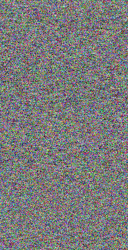
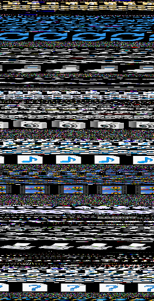
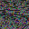

    
    <h1>Bincture</h1>

<h4 align="center">Tiny CLI binary data visualization tool.</h4>
<!--
-->
<!--    -->
<!--
-->

## 🖼 Examples
|explorer.exe (24-bit) | ELF binary (8-bit) | shell32.dll.mun (24-bit) | tui.c (16-bit)
|-|-|-|-|
| |  |  |

## ✨ Features
* Visualization can be saved with different bits per pixel value.
* Executable itself is tiny and takes up <100 kb of storage.

## 💿 Installation
### On Windows
Download the executable from [release page](https://github.com/Makzzzimus/bincture/releases/) and launch. No setup is required.

### On Debian-based Linux distros

### On RPM-based Linux distros

## 📝 License
Later

## 📑 Credits
### 🎇 Inspiration
* This application was inspired by some YouTube videos that showcased binary visualizations of different executables using this repo: [Binary Waterfall](https://github.com/nimaid/binary-waterfall/).

### 📚 External libraries used
* This project uses [conio](https://github.com/thradams/conio) library which is licensed under MIT license.

## 🌟Future of the project
From the start of development, this project was planned as a tiny toy to get in touch with the C programming language and low-level development overall. Indeed, **this project isn't meant for professional or day-to-day use**. But still, I would appreciate all feedback and repo stars! As a toy project **it isn't planned to receive any future updates**. Despite this, I have some ideas for new features and overall improvements. Maybe someday, I will return to the project, update it, or completely rewrite it from scratch.